<div align="center">


<h1>Terraform Enterprise Networking</h1>

<p><strong>The Strategic Foundation for Secure, Scalable, and Compliant Multi-Cloud Networking Architectures.</strong></p>

[]()
[]()
[]()

<br/>

> **"Code is the network."** 
> **Terraform Enterprise Networking (TF-Net)** is an institutional-grade repository designed to provide a secure, measurable, and highly automated foundation for global multi-cloud connectivity. It orchestrates the entire lifecycle of networking resources—from VPC/VNet provisioning and hub-and-spoke topology orchestration to real-time security control enforcement.

</div>

---

## 🏛️ Executive Summary

Networking is the nervous system of the enterprise cloud; manual configuration is a strategic liability. Organizations often fail to scale not because of a lack of bandwidth, but because of fragmented networking standards and an inability to enforce security controls with operational precision.

This platform provides the **Networking Automation Plane**. It implements a complete **Enterprise Infrastructure-as-Code Framework**, enabling network engineering teams to manage VPCs, Transits, and Firewalls as reusable, versioned modules. By treating networking as a primary automated capability, we ensure that the global infrastructure is continuously optimized and delivered with strategic architectural precision.

---

## 📐 Architecture Storytelling: Principal Reference Models

### 1. Principal Architecture: Global Enterprise Hub-and-Spoke Network
This diagram illustrates the end-to-end flow from on-premises data centers to multi-cloud spokes through a centralized network hub.

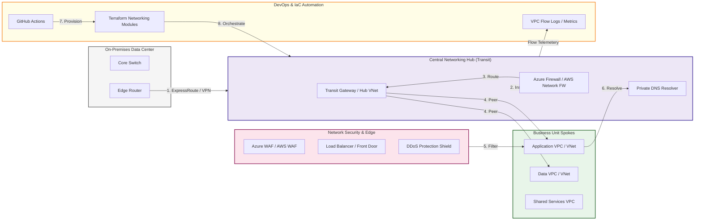

### 2. Hybrid Connectivity: Secure Tunneling Flow
The logical path for connecting legacy infrastructure to the cloud backbone.

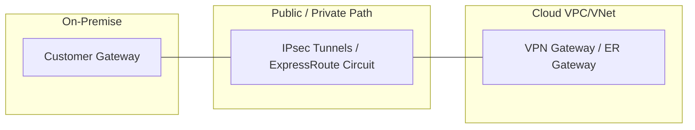

### 3. Cross-Region Peering & Global Backbone
Building a high-speed, low-latency mesh across global cloud regions.

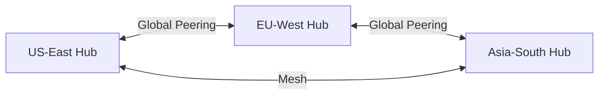

### 4. Network Security Perimeter: Tiered Defense
Filtering traffic through multiple layers of inspection.

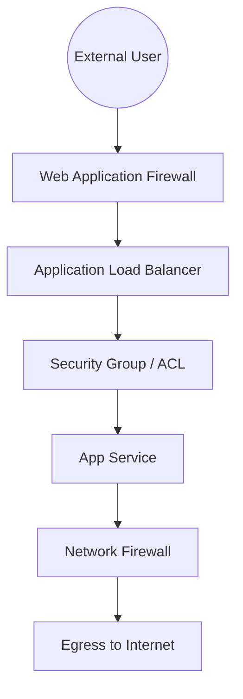

### 5. DNS & Resolution Hierarchy: Hybrid Mesh
How the platform resolves names across Cloud and On-Premises.

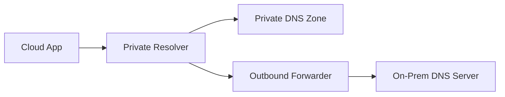

### 6. Load Balancing Strategy: Multi-Tier Traffic
Orchestrating traffic from the edge to the microservice.

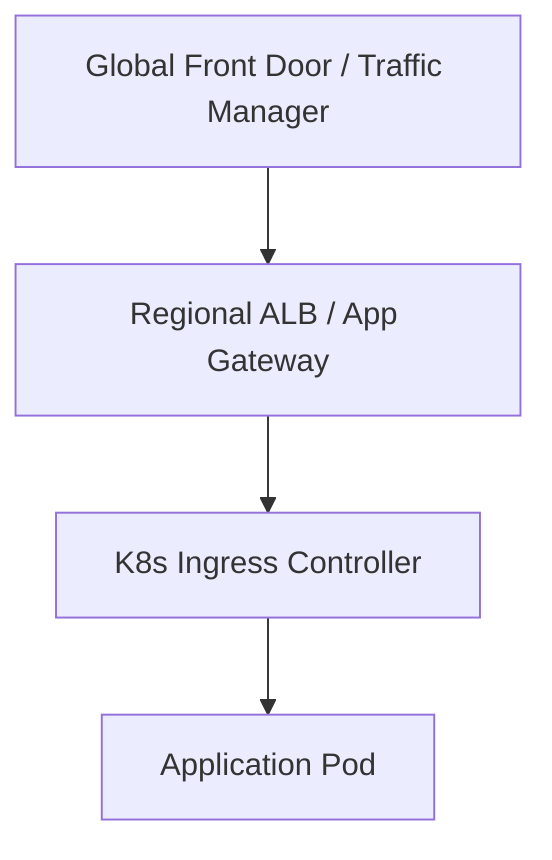

### 7. Private Link Flow: Secured PaaS Access
Connecting to cloud services without using public endpoints.

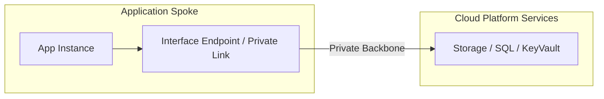

### 8. Traffic Mirroring & Inspection Hub
Duplicating packets for deep inspection by security appliances.

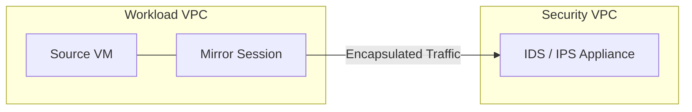

### 9. IaC Orchestration: Networking-as-Code
The lifecycle of a VPC module from definition to deployment.

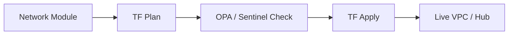

### 10. Governance & Compliance Loop: Guardrails
Ensuring network configurations never drift from security standards.

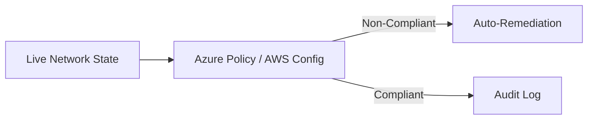

### 11. Disaster Recovery (DR) Path: Secondary Connectivity
Architecture for ensuring network uptime during a regional outage.

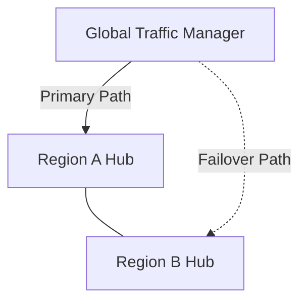

---

## 🏛️ Core Platform Pillars

1.  **Modular VPC Foundation**: Standardized HCL modules for provisioning secure, multi-AZ VPCs and VNets with optimized CIDR allocation.
2.  **Hub-and-Spoke Orchestration**: Centralized control plane for managing transit gateways and peering connectivity.
3.  **Private Connectivity Bridge**: Secured modules for ExpressRoute, Direct Connect, and VPN gateways.
4.  **Zero Trust Security Controls**: Code-driven enforcement of Firewalls, NSGs, and micro-segmentation.
5.  **Multi-Region Load Balancing**: Advanced orchestration of application gateways and global traffic management.
6.  **Unified Observability Hub**: Code-based configuration of VPC Flow Logs and real-time connectivity monitoring.

---

## 🛠️ Technical Stack & Implementation

### Terraform Engine & Modules
*   **IaC Engine**: Terraform 1.0+.
*   **Cloud Providers**: AWS, Azure, GCP (Modularized).
*   **Networking Modules**: VPC, VNet, Subnet, Peering, Transit Gateway, VPN, ExpressRoute.
*   **Validation**: `terraform validate`, `tflint`, and `checkov`.

### CI/CD & Security
*   **Automation**: GitHub Actions with OIDC federation.
*   **Governance**: Policy-as-code enforcement via OPA or Terraform Sentinels.
*   **Observability**: VPC Flow Logs integrated with CloudWatch/Azure Monitor.

---

## 🏗️ IaC Mapping (Module Structure)

| Module | Purpose | Real Services |
| :--- | :--- | :--- |
| **`modules/foundations`** | Core networking units | VPC, VNet, Subnets |
| **`modules/connectivity`** | Hybrid and hub networking | Transit Gateway, ER, VPN |
| **`modules/security`** | Network perimeter defense | Firewalls, WAF, NSGs |
| **`modules/traffic`** | Load balancing and DNS | ALB, Front Door, Private DNS |

---

## 🚀 Deployment Guide

### Local Principal Environment
```bash
# Clone the repository
git clone https://github.com/devopstrio/terraform-enterprise-networking.git
cd terraform-enterprise-networking

# Navigate to a reference environment
cd environments/dev

# Initialize terraform
terraform init

# Plan network infrastructure changes
terraform plan

# Apply infrastructure transformation
terraform apply
```

---

## 📜 License
Distributed under the MIT License. See `LICENSE` for more information.

---
<div align="center">
  <p>© 2026 Devopstrio. All rights reserved.</p>
</div>
