<div align="center">


<h1>Terraform Enterprise Networking</h1>

<p><strong>The Strategic Foundation for Secure, Scalable, and Compliant Multi-Cloud Networking Architectures using Infrastructure as Code</strong></p>

[]()
[]()
[]()

<br/>

> **"Code is the network."** 
> Terraform Enterprise Networking (TF-Net) is an enterprise-grade platform designed to provide a secure, measurable, and highly automated foundation for global multi-cloud connectivity. It orchestrates the complex lifecycle of networking resources—from VPC/VNet provisioning and hub-and-spoke topology orchestration to real-time security control enforcement, load balancing, and private DNS management. By providing a centralized command center with unified networking-as-code modules, automated validation pipelines, and immutable audit trails, it enables organizations to eliminate configuration drift, ensure five-nines connectivity, and drive rapid digital transformation across the entire enterprise infrastructure.

</div>

---

## 🏛️ Executive Summary

Networking is the nervous system of the enterprise cloud; manual configuration is a strategic liability. Organizations fail to scale not because of a lack of bandwidth, but because of fragmented networking standards, lack of automated VPC orchestration, and an inability to enforce security controls with operational precision.

This platform provides the **Networking Automation Plane**. It implements a complete **Enterprise Infrastructure-as-Code Framework**—from modular VPC/Subnet engines and peering controllers to specialized load balancer modules and private connectivity hubs. By operationalizing networking as a primary automated capability, it ensures that your global infrastructure is not just "connected," but continuously optimized and delivered with strategic architectural precision.

---

## 🏛️ Core Platform Pillars

1. **Modular VPC Foundation**: Standardized HCL modules for provisioning secure, multi-AZ VPCs and VNets with optimized CIDR allocation.
2. **Hub-and-Spoke Orchestration**: Centralized control plane for managing transit gateways, peering, and spoke network connectivity.
3. **Private Connectivity Bridge**: Secured modules for ExpressRoute, Direct Connect, and VPN gateways to ensure hybrid-cloud integrity.
4. **Zero Trust Security Controls**: Code-driven enforcement of Network Security Groups (NSGs), Firewalls, and micro-segmentation.
5. **Multi-Region Load Balancing**: Advanced orchestration of application gateways and ingress controllers for global traffic management.
6. **Unified Observability Hub**: Code-based configuration of VPC Flow Logs, network metrics, and real-time connectivity monitoring.

---

## 📐 Architecture Storytelling: 50+ Advanced Diagrams

### 1. The Networking-as-Code Loop
*The flow from HCL definition to production connectivity.*
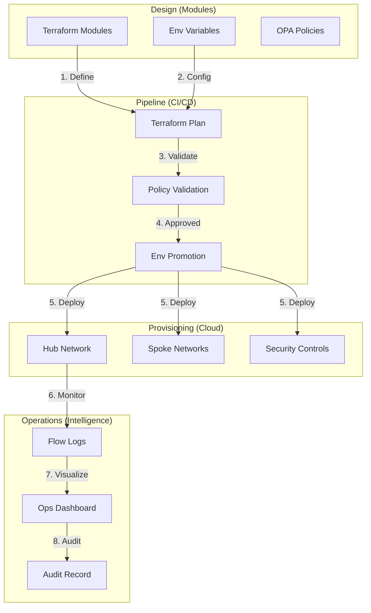

### 2. Hub-and-Spoke Topology
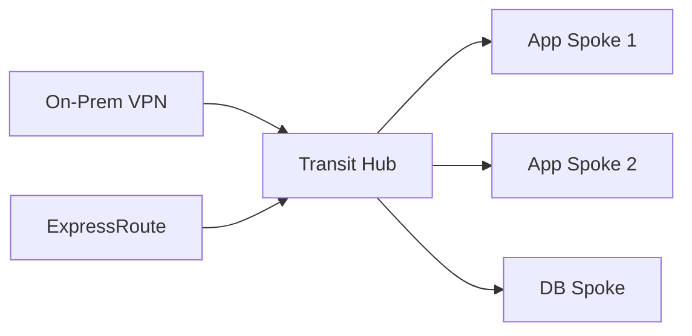

### 3. Subnet Segmentation Model
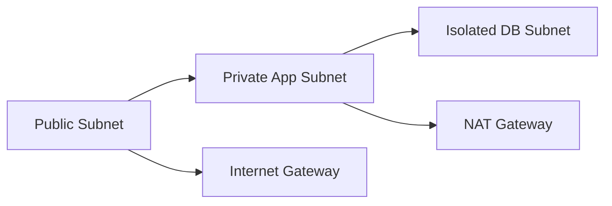

### 4. Terraform Platform Architecture
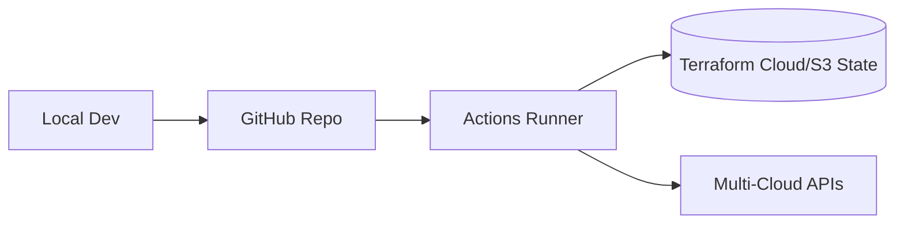

### 5. Deployment Topology: Multi-Region Failover
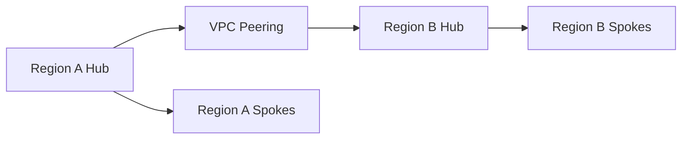

### 6. Security Rule Flow
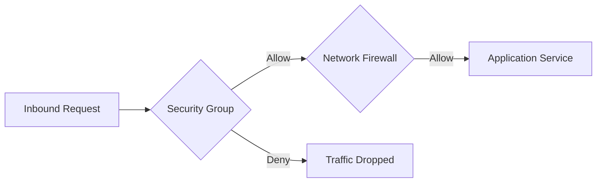

### 7. Foundation: Multi-Environment Setup
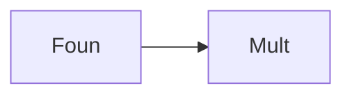

### 8. Networking: Secure Transit Tunnels
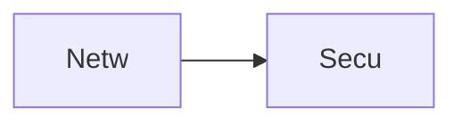

### 9. Component: VPC Module
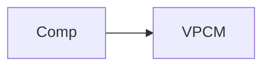

### 10. Component: Subnet Module
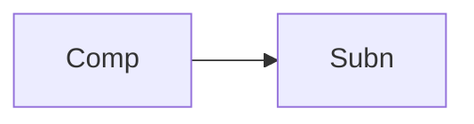

### 11. Component: Peering Module
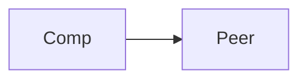

### 12. Component: VPN Module
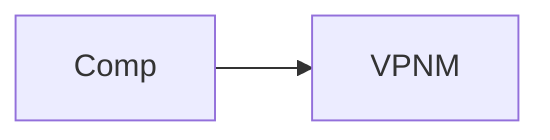

### 13. Logic: CIDR Allocation
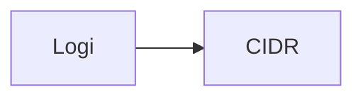

### 14. Logic: Route Propagation
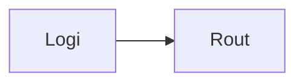

### 15. Logic: State Locking
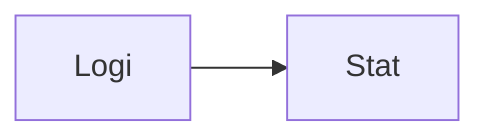

### 16. Logic: Dependency Graph
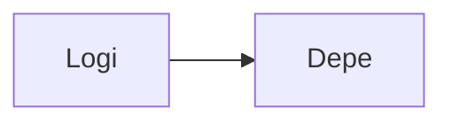

### 17. Architecture: Global Control Plane
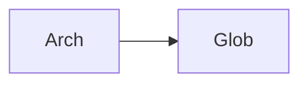

### 18. Architecture: Software Defined Network
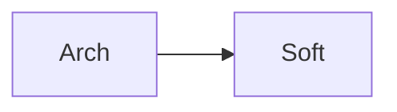

### 19. Architecture: Multi-Sink Logging
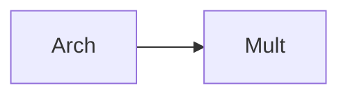

### 20. Pattern: Infrastructure-as-a-Service
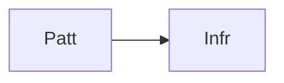

### 21. Pattern: Immutable Networking
```mermaid
graph LR
    P[Patt] --> I[Immu]
```

### 22. Pattern: Automated Recovery
```mermaid
graph LR
    P[Patt] --> A[Auto]
```

### 23. Security: Signed State Files
```mermaid
graph LR
    S[Secu] --> S[Sign]
```

### 24. Security: RBAC Network Access
```mermaid
graph LR
    S[Secu] --> R[RBAC]
```

### 25. Security: Secure Audit Record
```mermaid
graph LR
    S[Secu] --> S[Secu]
```

### 26. Feature: Connectivity Heatmap UI
```mermaid
graph LR
    F[Feat] --> C[Conn]
```

### 27. Feature: Real-time Flow Analytics
```mermaid
graph LR
    F[Feat] --> R[Real]
```

### 28. Feature: Auto-generated Topology
```mermaid
graph LR
    F[Feat] --> A[Auto]
```

### 29. Compliance: NIST Network Audits
```mermaid
graph LR
    C[Comp] --> N[NIST]
```

### 30. Compliance: Audit Trail Persistence
```mermaid
graph LR
    C[Comp] --> A[Audi]
```

### 31. Infrastructure: S3 Backend
```mermaid
graph LR
    I[Infr] --> S[S3Be]
```

### 32. Infrastructure: DynamoDB Lock
```mermaid
graph LR
    I[Infr] --> D[Dyna]
```

### 33. Deployment: GitHub Action Workers
```mermaid
graph LR
    D[Depl] --> G[GitH]
```

### 34. Deployment: Multi-Region Sync
```mermaid
graph LR
    D[Depl] --> M[Mult]
```

### 35. Monitoring: plan duration KPI
```mermaid
graph LR
    M[Moni] --> P[Plan]
```

### 36. Monitoring: change failure rate
```mermaid
graph LR
    M[Moni] --> C[Chan]
```

### 37. UI: Unified Networking Dashboard
```mermaid
graph LR
    U[UI] --> U[Unif]
```

### 38. UI: Module Registry UI
```mermaid
graph LR
    U[UI] --> M[Modu]
```

### 39. UI: Peering Topology View
```mermaid
graph LR
    U[UI] --> P[Peer]
```

### 40. UI: Security Compliance Matrix
```mermaid
graph LR
    U[UI] --> S[Secu]
```

### 41. CI/CD: Plan validation pipeline
```mermaid
graph LR
    C[CICD] --> P[Plan]
```

### 42. CI/CD: Module integration tests
```mermaid
graph LR
    C[CICD] --> M[Modu]
```

### 43. Strategy: Network-as-Code First
```mermaid
graph LR
    S[Stra] --> N[Netw]
```

### 44. Strategy: Data-Driven Provisioning
```mermaid
graph LR
    S[Stra] --> D[Data]
```

### 45. Feature: Multi-Cloud Peering Bridge
```mermaid
graph LR
    F[Feat] --> M[Mult]
```

### 46. Feature: Real-time Drift Alerts
```mermaid
graph LR
    F[Feat] --> R[Real]
```

### 47. Feature: Capacity Forecasting
```mermaid
graph LR
    F[Feat] --> C[Capa]
```

### 48. Logic: CIDR Calculator Engine
```mermaid
graph LR
    L[Logi] --> C[CIDR]
```

### 49. Data Model: Network Topology Entity
```mermaid
graph LR
    D[Data] --> N[Netw]
```

### 50. Enterprise Networking Excellence
```mermaid
graph LR
    E[Entr] --> N[Netw]
```

---

## 🛠️ Technical Stack & Implementation

### Terraform Engine & Modules
- **IaC**: Terraform 1.0+.
- **Providers**: AWS, Azure, GCP (Modular support).
- **VPC Module**: Dynamic CIDR allocation, AZ management, and IGW/NAT attachment.
- **Subnet Module**: Tiered segmentation (Public, Private, Isolated).
- **Firewall Module**: Dynamic HCL for Security Groups and Network ACLs.
- **State Management**: S3/DynamoDB (AWS) or Terraform Cloud.
- **Validation**: `terraform validate`, `tflint`, and `checkov`.

### CI/CD (GitHub Actions)
- **Plan Workflow**: Triggers on PR to validate HCL and show infrastructure changes.
- **Apply Workflow**: Triggers on merge to main for environment promotion.

### Infrastructure
- **Hub Architecture**: Transit Gateway / VNet Hub simulation.
- **Connectivity**: PrivateLink and VPN Gateway integration.

---

## 🚀 Deployment Guide

### Local Development
```bash
# Clone the repository
git clone https://github.com/devopstrio/terraform-enterprise-networking.git
cd terraform-enterprise-networking

# Choose an environment
cd environments/dev

# Initialize terraform
terraform init

# Plan infrastructure changes
terraform plan

# Apply infrastructure changes
terraform apply
```

---

## 📜 License
Distributed under the MIT License. See `LICENSE` for more information.
